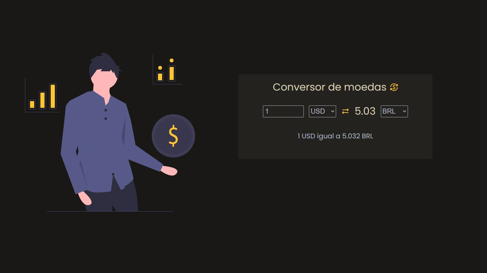

<h1 align="center">
  Conversor de moedas 
  
</h1>

<p align="center">
  <a href="#-tecnologias">Tecnologias</a>&nbsp;&nbsp;&nbsp;|&nbsp;&nbsp;&nbsp;
  <a href="#-descrição">Descrição</a>&nbsp;&nbsp;&nbsp;|&nbsp;&nbsp;&nbsp;
  <a href="#-projeto">Projeto</a>&nbsp;&nbsp;&nbsp;
</p>

</br>

<p align="center">
  
</p>

## 🚀 Tecnologias

Esse projeto foi desenvolvido com as seguintes tecnologias:

- HTML
- CSS
- JavaScript

</br>

## 🔖 Descrição

Aplicação desenvolvida para obter e relizar as conversões das moedas selecionadas. Foi utilizado a Exchange Rate API para buscar as informações de cada moeda.

</br>

## 💻 Projeto

Para clonar o projeto utilize o comando
```bash
$ git clone <https://github.com/andrewherculano/conversor-moedas.git>
```

Para testar o projeto acesse o [este link](https://compassionate-kepler-d7b414.netlify.app/).